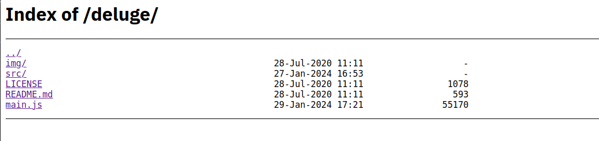
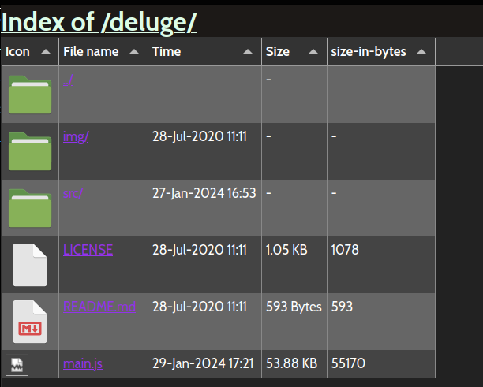

# tabulate-nginx-autoindex

A simple prettifier for Nginx autoindex, using tailwind CSS and tabulator.js. In short, we turn this:

into this:

You will need to take a look at the `sample.nginx.conf` as a guidance for your nginx configuration.
Then take a closer look at `header.html` and `footer.html`

A large portion of js was there to handle mime-type icon. The included icon `mimeypes` icons folder was from `https://github.com/PapirusDevelopmentTeam/papirus-icon-theme`